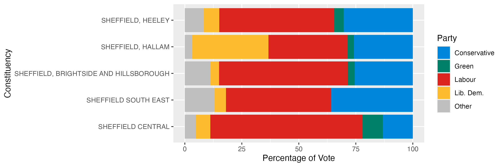

```{r}
library(tidyverse)
library(readxl)
```


First attempt to read using the `read_xlsx` package - which is developed specifically for `xls` and `xlsx` files. Even though the function runs without error, it's highly recommended to `View` the contents of the data frame.

```{r message=FALSE}
raw <- read_xlsx("1918-2019election_results_by_pcon.xlsx")
View(raw)
```

There's clearly some header information we need to deal with. The `skip` argument allows some rows in the input file to be ignored. 

```{r message=FALSE}
raw <- read_xlsx("1918-2019election_results_by_pcon.xlsx", skip = 3)
raw
```

And we need to select the particular sheet that we're interested in 

```{r}
excel_sheets("1918-2019election_results_by_pcon.xlsx")
raw <- read_xlsx("1918-2019election_results_by_pcon.xlsx", skip = 3,sheet = 29)
View(raw)
```

Lets use dplyr to pick columns of interest. Some manual renaming involved :/

```{r}
cleaned <- raw %>% 
  select(Constituency:Electorate, Turnout, `Total votes`, contains("Votes...")) %>% 
  rename("Conservative" = `Votes...8`,
         "Labour" = `Votes...11`,
         "Lib. Dem." = `Votes...14`,
         "Brexit" = `Votes...17`,
         "Green" = `Votes...20`,
         "SNP" = `Votes...23`,
         "Plaid Cymru" = `Votes...26`,
         "DUP" = `Votes...29`,
         "Sinn Fein" = `Votes...32`,
         "SDLP" = `Votes...35`,
         "UUP" = `Votes...38`,
         "Alliance" = `Votes...41`,
         "Other" = `Votes...44`)
cleaned
```
However, a bit of inspection shows some extra rows in the file that shouldn't have been included.

```{r}
tail(cleaned)
```

Such problematic rows can be identified by having an `NA` in the `Country` column

```{r}
cleaned <- filter(cleaned, !is.na(Country))
```


We can save as csv file for future use.

```{r}
write_csv(cleaned, "uk_election_2019.csv")
```

If at any point we need to read the original data we can do:-

```{r}
cleaned <- read_csv("uk_election_2019.csv")
```

As part of understanding the data it is helpful to carry out a few checks on the data quality. Although we have the total number of votes as a column, we can check that this has been computed correctly. 

```{r}
cleaned %>% 
  mutate(Total_votes_calc = Electorate * Turnout) %>%
  select(`Total votes`, Total_votes_calc)
```

Exercise:

Investigate the `arrange` function to find the smallest and largest Electorates. Can you find the smallest / largest within each country?

```{r}
ggplot(cleaned, aes(x = Electorate)) + geom_histogram()
```


Lets see if the number of votes is related to the size of the electorate (it should be!). 


```{r}
ggplot(cleaned, aes(x = Electorate, y = `Total votes`)) +
  geom_point()
```


```{r}
ggplot(cleaned, aes(x = Electorate, y = `Total votes`)) +
  geom_point() + geom_smooth(method = "lm")
```

The add-on package `ggpubr` allows us to 
```{r}
library(ggpubr)
ggplot(cleaned, aes(x = Electorate, y = `Total votes`)) +
  geom_point() + geom_smooth(method = "lm") + stat_cor()
```

- Show the turnout variable against Country. Is there a difference?
- Plot Conservative votes against Labour. Is it how you expect? Try colouring by the Country


A useful plotting technique is to split a figure depending on a variable. Here, we can plot the size of electorate against total votes for each country

```{r}
ggplot(cleaned, aes(x = Electorate, y = `Total votes`)) +
  geom_point() + geom_smooth(method = "lm") + stat_cor() + facet_wrap(~Country)
```

But how many votes did the parties get? We can start by adding up the respective columns

```{r}
cleaned %>% 
  summarize_at(vars(Conservative:Alliance),sum, na.rm = TRUE)
```
But what happens if we try and visualise? Try and write the ggplot code..

```{r eval=FALSE}
cleaned %>% 
  summarize_at(vars(Conservative:Alliance),sum, na.rm = TRUE) %>% 
  ggplot(aes(x = , y = )) + geom_col()
```

We can't do this at the moment, because the data are wide rather than long.

```{r}
library(forcats)
total_votes <- 
cleaned %>% 
  summarize_at(vars(Conservative:Other),sum, na.rm = TRUE) %>% 
  pivot_longer(everything(),values_to = "Votes", names_to = "Party") %>% 
  mutate(Party = fct_reorder(Party, Votes))
```

```{r}
total_votes %>% 
  ggplot(aes(x = Party, y = Votes, fill=Party)) + geom_col()
```
However, these summed values don't acutally tell us who one the election. Instead, we need to know who won in each constituency.

```{r}
cleaned %>% 
  pivot_longer(Conservative:Other, names_to = "Party", values_to ="Votes") %>% 
  filter(!is.na(Votes))
  
```

Calculate the percentage of votes for each party in each constituency.

```{r}
cleaned %>% 
  pivot_longer(Conservative:Other, names_to = "Party", values_to ="Votes") %>% 
  filter(!is.na(Votes)) %>% 
  mutate(`Percentage of Vote` = (Votes / `Total votes`)*100)
```
We can now drill-down into the results for particular constituencies. Lets' look at all the Sheffield results for the four biggest parties. 

```{r}
shef_votes <- cleaned %>% 
  pivot_longer(Conservative:Other, names_to = "Party", values_to ="Votes") %>% 
  filter(!is.na(Votes)) %>% 
  mutate(`Percentage of Vote` = (Votes / `Total votes`)*100) %>% 
  filter(grepl("SHEFFIELD", Constituency), 
         Party %in% c("Conservative", "Green", "Labour", "Lib. Dem.")) 
```

Produce the following graph to show the vote split for the different parts of Sheffield. These colours were used in the example plot:-

```{r eval=FALSE}
c("#0087DC", "#008066","#DC241f","#FDBB30")
```




Now to determine the winners for each constituency. To do this, we will order the percentage of votes within each constituency

```{r}
cleaned %>% 
  pivot_longer(Conservative:Other, names_to = "Party", values_to ="Votes") %>% 
  filter(!is.na(Votes)) %>% 
  mutate(`Percentage of Vote` = (Votes / `Total votes`)*100) %>% 
  group_by(Constituency) %>% 
  arrange(desc(`Percentage of Vote`),.by_group = TRUE)
```
To calculate the majority (i.e. how much each seat was won by), we'll need the first and second place votes.

```{r}
cleaned %>% 
  pivot_longer(Conservative:Other, names_to = "Party", values_to ="Votes") %>% 
  filter(!is.na(Votes)) %>% 
  mutate(`Percentage of Vote` = (Votes / `Total votes`)*100) %>% 
  group_by(Constituency) %>% 
  arrange(desc(`Percentage of Vote`),.by_group = TRUE) %>% 
  slice(1:2) %>% 
  mutate(`Second Place` = lead(`Percentage of Vote`,order_by = Constituency), Majority = `Percentage of Vote` - `Second Place`)
```

Finally, we can select the winner of each seat and their majority.

```{r}
results <- cleaned %>% 
  pivot_longer(Conservative:Other, names_to = "Party", values_to ="Votes") %>% 
  filter(!is.na(Votes)) %>% 
  mutate(`Percentage of Vote` = (Votes / `Total votes`)*100) %>% 
  group_by(Constituency) %>% 
  arrange(desc(`Percentage of Vote`),.by_group = TRUE) %>% 
  slice(1:2) %>% 
  mutate(`Second Place` = lead(`Percentage of Vote`,order_by = Constituency), Majority = `Percentage of Vote` - `Second Place`) %>% 
  slice(1)
```


We can now work out the number of seats

```{r}
results %>% 
  group_by(Party) %>% 
  summarize(Seats = n())
```

