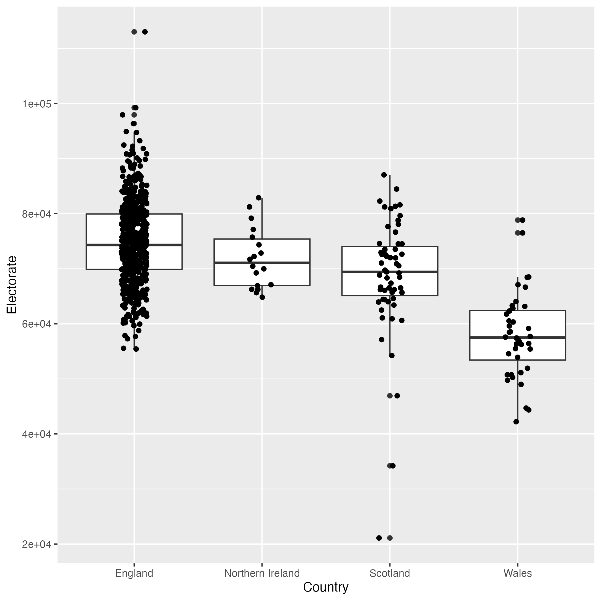

# Outline

In this tutorial we will introduction / review some concepts of using `dplyr`, `ggplot2` and other parts of the "tidyverse". Briefly:-

- Data Import
  - From Xlsx and csv formats
- Data Cleaning
  - Renaming columns, filtering, transforming columns
- Data Manipulation
  - "Wide" vs "Long" data
  - (Re-)arranging rows
  - Grouping and summarising tables
- Data Visualisation
  - Basic plot types
  - Splitting-up plots based on variables - faceting
  - Using colours


For more information on these key packages you can consult the "cheatsheets" available through the help menus, or from the [tidyverse](https://www.tidyverse.org/) website itself.

# Get Started

Lets' load the packages we will need. `tidyverse` will load all the packages we need

```{r}
library(tidyverse)
library(readxl)
```


First attempt to read using the `read_xlsx` package - which is developed specifically for `xls` and `xlsx` files. Even though the function runs without error, it's highly recommended to `View` the contents of the data frame.

```{r message=FALSE}
raw <- read_xlsx("1918-2019election_results_by_pcon.xlsx")
View(raw)
```

There's clearly some header information we need to deal with. The `skip` argument allows some rows in the input file to be ignored. 

```{r message=FALSE}
raw <- read_xlsx("1918-2019election_results_by_pcon.xlsx", skip = 3)
raw
```

And we need to select the particular sheet that we're interested in 

```{r}
excel_sheets("1918-2019election_results_by_pcon.xlsx")
raw <- read_xlsx("1918-2019election_results_by_pcon.xlsx", skip = 3,sheet = 29)
```

Lets use dplyr to pick columns of interest. Some manual renaming involved :/

```{r}
cleaned <- raw %>% 
  select(Constituency:Electorate, Turnout, `Total votes`, contains("Votes...")) %>% 
  rename("Conservative" = `Votes...8`,
         "Labour" = `Votes...11`,
         "Lib. Dem." = `Votes...14`,
         "Brexit" = `Votes...17`,
         "Green" = `Votes...20`,
         "SNP" = `Votes...23`,
         "Plaid Cymru" = `Votes...26`,
         "DUP" = `Votes...29`,
         "Sinn Fein" = `Votes...32`,
         "SDLP" = `Votes...35`,
         "UUP" = `Votes...38`,
         "Alliance" = `Votes...41`,
         "Other" = `Votes...44`)
cleaned
```
However, a bit of inspection shows some extra rows in the file that shouldn't have been included.

```{r}
tail(cleaned)
```

Such problematic rows can be identified by having an `NA` in the `Country` column

```{r}
cleaned <- filter(cleaned, !is.na(Country))
```


We can save as csv file for future use.

```{r}
write_csv(cleaned, "uk_election_2019.csv")
```

If at any point we need to read the original data we can do:-

```{r}
cleaned <- read_csv("uk_election_2019.csv")
```

As part of understanding the data it is helpful to carry out a few checks on the data quality. Although we have the total number of votes as a column, we can check that this has been computed correctly. 

```{r}
cleaned %>% 
  mutate(Total_votes_calc = Electorate * Turnout) %>%
  select(`Total votes`, Total_votes_calc)
```

We now have some data that we can start to visualise. For this we are going to use the `ggplot2` package. This is a *flexible* and *extendable* plotting framework with a consistent interface. It can make publication-ready figures with less effort than "base" R. With some practice, you will spend less time writing code to make figures and **more time interpreting and interrogating your data** - which is what we really want to spend our time doing!

A useful resource to guide us in making our figures is data-to-viz. Sometimes it can even help to sketch a figure first using pencil and paper.

- [Choose the most appropriate figure for your data - data-to-viz](https://www.data-to-viz.com/)

We start by looking at the size of electorate size (the number of people eligible to vote in each region). Since this is a single continuous variable, a number of different plots are available to use. We will use a histogram.

The different components required for a ggplot are:-

- the data frame that you want to plot
- definitions of how to plot variables / columns in that data to the plot aesthetics (x-axis, y-axis, colour, shape etc)
- what type of plot (geom_) you want


```{r}
ggplot(cleaned, aes(x = Electorate)) + geom_histogram()
```

Changing the type of plot, for the same variable, can be achieved by changing the `geom_`

```{r}
ggplot(cleaned, aes(x = Electorate)) + geom_density()
```
```{r}
ggplot(cleaned, aes(x = Electorate)) +geom_histogram(aes(y = ..density..)) + geom_density(col="blue")
```

N.B the `gghistogram` function from `ggpubr` combined with `stat_overlay_normal_density` gives us a way to overlay the *standard* normal distribution

```{r}
gghistogram(cleaned, "Electorate",y = "..density..") + stat_overlay_normal_density(col="red",lty=2)
```


---

**Exercise**

- Visualise the distribution of electorate sizes in different countries?
  - as a boxplot with jittered (geom_jitter) points overlaid
  
  

---

Lets see if the number of votes is related to the size of the electorate (it should be!). 


```{r}
ggplot(cleaned, aes(x = Electorate, y = `Total votes`)) +
  geom_point()
```
Since we can add different types of plot, it will be useful to add a straight line.

```{r}
ggplot(cleaned, aes(x = Electorate, y = `Total votes`)) +
  geom_point() + geom_smooth(method = "lm")
```

The add-on package `ggpubr` allows us to add the correlation value onto the graph. Other functions from this package allow us to add p-values etc when comparing distributions via boxplots.

```{r}
library(ggpubr)
ggplot(cleaned, aes(x = Electorate, y = `Total votes`)) +
  geom_point() + geom_smooth(method = "lm") + stat_cor()
```

Is this same trend observed for all Countries? One way to look at this would be use different colours. This can be done by defining the `col` aesthetic. It will assign colours in a sensible fashion, and we can also define our own palette.


```{r}
ggplot(cleaned, aes(x = Electorate, y = `Total votes`, col = Country)) +
  geom_point()
```
Colours can be defined using the `scale_color_manual` function. Here we make use of the `RColorBrewer` package for a pre-defined set. However, in the following code the contents of `my_colours` could be any combination of colour names or rgb.

```{r}
library(RColorBrewer)
my_colours <- brewer.pal(4, "Set1")
my_colours
ggplot(cleaned, aes(x = Electorate, y = `Total votes`, col = Country)) +
  geom_point() + scale_color_manual(values=my_colours)
```


A useful plotting technique is to split a figure depending on a variable. Here, we can plot the size of electorate against total votes for each country

```{r}
ggplot(cleaned, aes(x = Electorate, y = `Total votes`)) +
  geom_point() + geom_smooth(method = "lm") + stat_cor() + facet_wrap(~Country)
```

We can compare numbers of votes between different regions. Let's look at Sheffield

```{r}
shef_data <- filter(cleaned, grepl("SHEFF",Constituency))
```
```{r}
ggplot(shef_data, aes(x = Constituency, y = Conservative)) + geom_col(fill="#0087DC")
```

But how many votes did the parties get overall, and who won? We can start by adding up the respective columns. The `summarize`/`summarise` collection of functions allow many ways to summarise our data. The general approach is to use specify what summary function you want to use on which columns, and say what you want the result to be called:-

```{r}
## na.rm needed as there are some 'NA' values which would result in 'NA' for the sum

summarise(cleaned, 
          Conservative_Votes = sum(Conservative,na.rm = TRUE))
```
Typically the summary functions are used for descriptive statistics; )`mean`, `median`, `sd`, `var` etc) and give a **single value**. However, we don't want to spend our time typing out code to summarise all the colums we are interested in

```{r}
## Don't do this - unless you have very few columns

summarise(cleaned, 
          Conservative_Votes = sum(Conservative,na.rm = TRUE),
          Labour_Votes = sum(Labour, na.rm = TRUE),
          Lib_Dem_Votes = sum(`Lib. Dem.`,na.rm=TRUE)
          )
```
`dplyr` is replete with shortcuts that are designed to make your life easier. 

```{r}
summarize_at(cleaned, vars(Conservative:Alliance),sum, na.rm = TRUE)
```
But what happens if we try and visualise? Try and write the `ggplot` code.

```{r eval=FALSE}
## don't try and run this - it won't work!
cleaned %>% 
  summarize_at(vars(Conservative:Alliance),sum, na.rm = TRUE) %>% 
  ggplot(aes(x = , y = )) + geom_col()
```

We can't do this at the moment, because the data are "wide" rather than "long". To make the data long, we can specify a set of paired key:value columns. In our case, we want a column that gives a number of votes, and a column to tell us which party those votes were for.


```{r}
vote_sums <- summarize_at(cleaned, vars(Conservative:Alliance),sum, na.rm = TRUE)
pivot_longer(vote_sums, everything(), values_to = "Votes", names_to = "Party")
```

## Let's talk about "piping"

A relatively recent addition to the R language is the concept of piping, which can help us to make code easier to write (and read). The premise is that one line of code is used as the input for the following line. This is especially effective in dplyr, where must functions take a data frame as an input and return a data frame as an output. When looking at code online, you will see many examples of code written in this fashion. The `%>%` symbols at the end of a line are a giveaway. The shortcut CTRL + SHIFT + M is used to print this.

```{r}
total_votes <- 
cleaned %>% 
  summarize_at(vars(Conservative:Other),sum, na.rm = TRUE) %>% 
  pivot_longer(everything(),values_to = "Votes", names_to = "Party") %>% 
  mutate(Party = fct_reorder(Party, Votes))
```

You can also "pipe" between dplyr and ggplot2 code

```{r}
total_votes %>% 
  ggplot(aes(x = Party, y = Votes, fill=Party)) + geom_col()
```
However, these summed values don't acutally tell us who one the election. Instead, we need to know who won in each constituency.

```{r}
cleaned %>% 
  pivot_longer(Conservative:Other, names_to = "Party", values_to ="Votes") %>% 
  filter(!is.na(Votes))
  
```

Calculate the percentage of votes for each party in each constituency.

```{r}
cleaned %>% 
  pivot_longer(Conservative:Other, names_to = "Party", values_to ="Votes") %>% 
  filter(!is.na(Votes)) %>% 
  mutate(`Percentage of Vote` = (Votes / `Total votes`)*100)
```
We can now drill-down into the results for particular constituencies. Lets' look at all the Sheffield results for the four biggest parties. 

```{r}
shef_votes <- cleaned %>% 
  pivot_longer(Conservative:Other, names_to = "Party", values_to ="Votes") %>% 
  filter(!is.na(Votes)) %>% 
  mutate(`Percentage of Vote` = (Votes / `Total votes`)*100) %>% 
  filter(grepl("SHEFFIELD", Constituency), 
         Party %in% c("Conservative", "Green", "Labour", "Lib. Dem.")) 
```

----

**Exercise**

Produce the following graph to show the vote split for the different parts of Sheffield. These colours were used in the example plot:-

```{r eval=FALSE}
c("#0087DC", "#008066","#DC241f","#FDBB30")
```


----

Now to determine the winners for each constituency. To do this, we will order the percentage of votes within each constituency by first grouping within constituency and then using `arrange`.

```{r}
cleaned %>% 
  pivot_longer(Conservative:Other, names_to = "Party", values_to ="Votes") %>% 
  filter(!is.na(Votes)) %>% 
  mutate(`Percentage of Vote` = (Votes / `Total votes`)*100) %>% 
  group_by(Constituency) %>% 
  arrange(desc(`Percentage of Vote`),.by_group = TRUE)
```
To calculate the majority (i.e. how much each seat was won by), we'll need the first and second place votes. The `lead` function is used to find the second highest number of votes.

```{r}
cleaned %>% 
  pivot_longer(Conservative:Other, names_to = "Party", values_to ="Votes") %>% 
  filter(!is.na(Votes)) %>% 
  mutate(`Percentage of Vote` = (Votes / `Total votes`)*100) %>% 
  group_by(Constituency) %>% 
  arrange(desc(`Percentage of Vote`),.by_group = TRUE) %>% 
  slice(1:2) %>% 
  mutate(`Second Place` = lead(`Percentage of Vote`,order_by = Constituency), Majority = `Percentage of Vote` - `Second Place`)
```

Finally, we can select the winner of each seat and their majority.

```{r}
results <- cleaned %>% 
  pivot_longer(Conservative:Other, names_to = "Party", values_to ="Votes") %>% 
  filter(!is.na(Votes)) %>% 
  mutate(`Percentage of Vote` = (Votes / `Total votes`)*100) %>% 
  group_by(Constituency) %>% 
  arrange(desc(`Percentage of Vote`),.by_group = TRUE) %>% 
  slice(1:2) %>% 
  mutate(`Second Place` = lead(`Percentage of Vote`,order_by = Constituency), Majority = `Percentage of Vote` - `Second Place`) %>% 
  slice(1)
```

Did some parties win by slimmer majorities?

```{r}
results %>% 
  filter(Party %in% c("Conservative", "Green", "Labour", "Lib. Dem.","SNP")) %>% 
  ggplot(aes(x = Party, y = Majority,fill=Party)) + geom_boxplot() + geom_jitter(width=0.1) + scale_fill_manual(values=c("#0087DC", "#008066","#DC241f","#FDBB30","#FFFF00"))
```


We can now work out the number of seats

```{r}
seats_2019 <- results %>% 
  ungroup() %>% 
  count(Party) %>% 
  rename(Seats = n)
write_csv(seats_2019, "2019_seats.csv")
```

```{r}
seats_2019 %>% 
  filter(Party %in% c("Conservative", "Green", "Labour", "Lib. Dem.","SNP")) %>% 
ggplot(aes(x = fct_reorder(Party, Seats),y = Seats,fill=Party)) + geom_col() + scale_fill_manual(values=c("#0087DC", "#008066","#DC241f","#FDBB30","#FFFF00")) + xlab("Party") + ylab("Number of Seats")
```

